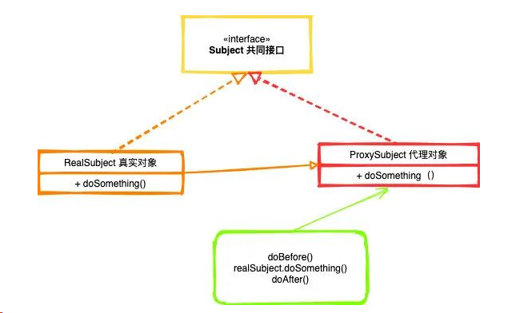

## 代理模式

>- 远程代理：就是将工作委托给远程对象（不同的服务器，或者不同的进程）来完成。常见的是用在web Service中。还有就是我们的RPC调用也可以理解为一种远程代理。
>- 保护代理：该模式主要进行安全/权限检查。
>- 缓存代理：通过存储来加速调用，比如Sping中的@Cacheable方法，缓存特定的参数获取到的结果，当下次相同参数调用该方法，直接从缓存中返回数据。
>- 虚拟代理：这种代理主要是为方法增加功能，比如记录一些性能指标等，或进行延迟初始化

>- Subject（共同接口）：客户端使用的现有接口
>- RealSubject（真实对象）：真实对象的类
>- ProxySubject（代理对象）：代理类

### 静态代理

>- 第一种：采用类加载器形式，去加载实列对象，这样我们就不同关心到底什么时候需要真实的实列化对象
>- 第二种：通过传值的形式，把实列化对象传过来。（理解为装饰器模式）
>
>静态代理需要为每一个对象都创建一个代理类，增加了维护成本以及开发成本

### 动态代理

#### jdk代理

>动态代理合理的避免了静态代理的那种方式，不用事先为要代理的类而构建好代理类。而是在运行时通过反射机制创建。
>
>代理模式组成：
>
>- 接口：声明需要被监听行为
>- 代理实现类（InvocationHandler）:次要业务，次要业务和主要业务绑定执行
>- 代理对象（监听对象）

>* Proxy 可以理解为就是调度器
>
>* InvocationHandler  增强服务接口，可以理解为代理器

#### cglib代理

>Cglib 无需通过接口来实现，它是通过实现子类的方式来完成调用的
>
>* MethodInterceptor

#### JDK和Cglib的区别

> jdk动态代理是利用反射机制生成一个实现代理接口的匿名类，在调用具体方法前调用InvokeHandler来处理
>
> cglib动态代理是利用ASM开源包，对被代理对象类的class文件加载进来，通过修改其字节码生成子类来处理
>
> ASM: 一个 Java 字节码操控框架。它能被用来动态生成类或者增强既有类的功能。ASM 可以直接产生二进制 class 文件，也可以在类被加载入 Java 虚拟机之前动态改变类行为。Java class 被存储在严格格式定义的 .class 文件里，这些类文件拥有足够的元数据来解析类中的所有元素：类名称、方法、属性以及 Java 字节码（指令）。ASM 从类文件中读入信息后，能够改变类行为，分析类信息，甚至能够根据用户要求生成新类。   

#### 多级动态代理

>套娃

