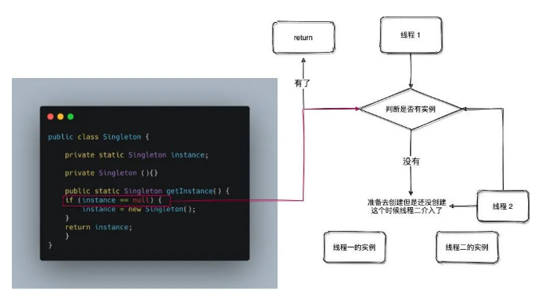

## 单例模式

`定义`

>确保某一个类只有一个实例，而且自行实例化并向整个系统提供这个实例
>
>- 在Java应用中，单例模式能保证在一个JVM中，该对象只有一个实例存在
>- 构造器必须是私有的，外部类无法通过调用构造器方法创建该实例
>- 没有公开的set方法，外部类无法调用set方法创建该实例
>- 提供一个公开的get方法获取唯一的这个实例

`优势`

>- 某些类创建比较频繁，对于一些大型的对象，这是一笔很大的系统开销
>- 省去了new操作符，降低了系统内存的使用频率，减轻GC压力
>- 系统中某些类，如spring里的controller，控制着处理流程，如果该类可以创建多个的话，系统完全乱了
>- 避免了对资源的重复占用

`使用场景`

>● 要求生成唯一序列号的环境；
>● 在整个项目中需要一个共享访问点或共享数据，例如一个 Web 页面上的计数器，可以不用把每次刷新都记录到数据库中，使用单例模式保持计数器的值，并确保是线程安全的；
>● 创建一个对象需要消耗的资源过多，如要访问 IO 和数据库等资源；
>● 需要定义大量的静态常量和静态方法（如工具类）的环境，可以采用单例模式（也可以直接声明为 static 的方式）。

### 饿汉式

>提前把对象new出来，这样别人哪怕是**第一次**获取这个类对象的时候直接就存在这个类了，省去了创建类这一步的开销
>
>**线程安全**

```java
public class HungryTypeSingleton {
    
	// 创建一个实例对象
    private static HungryTypeSingleton instance=new HungryTypeSingleton();
    
    /**
     * 私有构造方法，防止被实例化
     */
    private HungryTypeSingleton() {}
    
    /**
     * 静态get方法
     */
    public static HungryTypeSingleton getInstance() {
        return instance;
    }
}
```

### 懒汉式

>第一次调用的时候他发现自己的实例是空的，然后去初始化了，再赋值
>
>**线程不安全**

```java
public class LazyTypeSingleton {

    private static LazyTypeSingleton instance;

    private LazyTypeSingleton() {
    }

    public static LazyTypeSingleton getInstance() {
        if (instance == null) {
            instance = new LazyTypeSingleton();
        }
        return instance;
    }
}
```

#### 线程安全问题解析



>多个线程去调用getInstance方法来获取Singleton的实例，那么就有可能发生这样一种情况:
>
>当第一个线程在执行if（instance==null）时，此时instance是为null的进入语句。在还没有执行instance=new Singleton()时（此时instance是为null的）第二个线程也进入了if(instance==null)这个语句，因为之前进入这个语句的线程中还没有执行instance=new Singleton()，所以它会执行instance = new Singleton()来实例化Singleton对象，因为第二个线程也进入了if语句所以它会实例化Singleton对象。这样就导致了实例化了两个Singleton对象。

### 双重锁式

>**线程安全**

```java
public class DoubleLockSingleton {

    /**
     * volatile关键字:
     * 为 instance 分配内存空间
     * 初始化 instance
     * 将 instance 指向分配的内存地址
     * 使用 volatile 可以禁止 JVM 的指令重排，保证在多线程环境下也能正常运行。
     */
    private volatile static DoubleLockSingleton instance = null;

    private DoubleLockSingleton() {}


    public static DoubleLockSingleton getInstance() {
        // 先检查实例是否存在，如果不存在才进入下面的同步块
        if (instance == null) {
            // 同步块，线程安全的创建实例
            synchronized (DoubleLockSingleton.class) {
                // 再次检查实例是否存在，如果不存在才真正的创建实例
                if (instance == null) {
                    instance = new DoubleLockSingleton();
                }
            }
        }
        return instance;
    }
}
```

#### volatile分析

>在Java指令中创建对象和赋值操作是分开进行的，也就是说instance = new Singleton();语句是分两步执行的。
>
>但是JVM并不保证这两个操作的先后顺序，也就是说有可能JVM会为新的Singleton实例分配空间，然后直接赋值给instance成员，然后再去初始化这个Singleton实例。
>
>以A、B两个线程为例：
>
>1. A、B线程同时进入了第一个if判断
>2. A首先进入synchronized块，由于instance为null，所以它执行instance = new Singleton();
>3. 由于JVM内部的优化机制，JVM先画出了一些分配给Singleton实例的空白内存，并赋值给instance成员（注意此时JVM没有开始初始化这个实例），然后A离开了synchronized块。
>4. B进入synchronized块，由于instance此时不是null，因此它马上离开了synchronized块并将结果返回给调用该方法的程序。
>5. 此时B线程打算使用Singleton实例，却发现它没有被初始化，于是错误发生了。
>
>通过volatile修饰的变量，不会被线程本地缓存，所有线程对该对象的读写都会第一时间同步到主内存，从而保证多个线程间该对象的准确性
>
>**volatile的作用**
>
>- 防止指令重排序，因为instance = new Singleton()不是原子操作
>- 保证内存可见

### 静态内部类

>使用内部类来维护单例的实现，JVM内部的机制能够保证当一个类被加载的时候，这个类的加载过程是线程互斥的。
>
>**线程安全**

```java
public class StaticInnerSingleton {

    /**
     * 私有构造方法，防止被实例化
     */
    private StaticInnerSingleton() {}

    /**
     * 此处使用一个内部类来维护单例
     * 只有当调用 getInstance() 方法从而触发 SingletonFactory.INSTANCE 时 SingletonFactory 才会被加载进内存
     * 此时初始化 INSTANCE 实例，并且 JVM 能确保 INSTANCE 只被实例化一次。
     */
    private static class SingletonFactory {
        private static final StaticInnerSingleton INSTANCE = new StaticInnerSingleton();
    }

    public static StaticInnerSingleton getInstance() {
        return SingletonFactory.INSTANCE;
    }

    /**
     * 如果该对象被用于序列化，可以保证对象在序列化前后保持一致
     */
    public Object readResolve() {
        return getInstance();
    }
}
```

### 枚举类

>使用枚举来实现单实例控制会更加简洁，JVM从根本上提供保障，防止多次实例化

```java
public enum SingletonEnum {
    INSTANCE;
}
```

`测试用例`

```java
public static void main(String[] args) {

    // 单例测试
    SingletonEnum firstSingleton = SingletonEnum.INSTANCE;

    System.out.println(firstSingleton);
    SingletonEnum secondSingleton = SingletonEnum.INSTANCE;
    System.out.println(secondSingleton);

    // 反射获取实例测试
    try {
        SingletonEnum[] enumConstants = SingletonEnum.class.getEnumConstants();
        for (SingletonEnum enumConstant : enumConstants) {
            System.out.println(enumConstant);
        }
    } catch (Exception e) {
        e.printStackTrace();
    }
}
```

