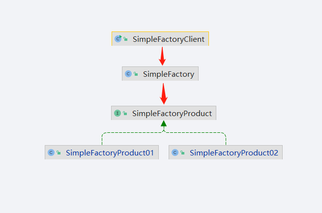
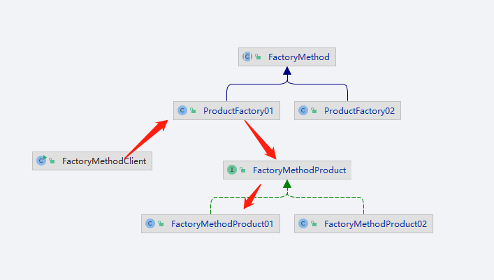
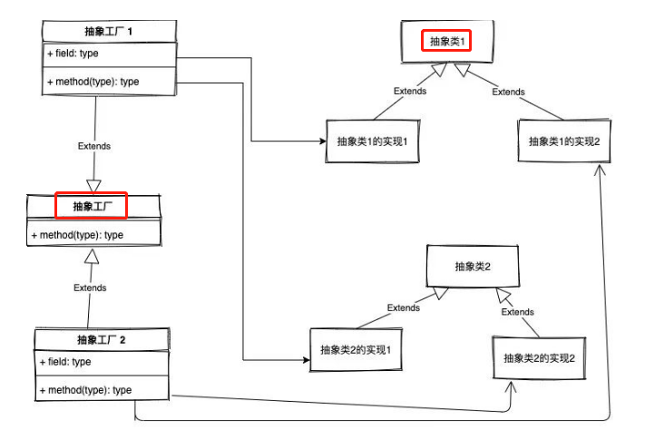
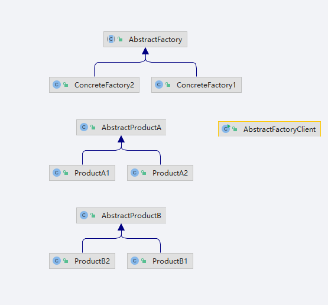

## 工厂模式

`定义`

>定义一个用于创建对象的接口，让子类决定实例化哪一个类。工厂方法使一个类的实例化延迟到其子类。


### 简单工厂模式

#### 静态工厂模式

>简单工厂牧师，如果要创建商品1 以及商品2，我们要创建商品的时候只要调用简单工厂里面的创建商品方法
>
>根据类型创建出不同的商品然后实列化返回就可以了。



### 工厂方法模式

>工厂方法模式是对静态工厂模式的上的一种改进，我们的工厂类直接被抽象化，需要具体特定化的逻辑代码转移到实现抽象方法的子类中，这样我们就不要再去修改工厂类



### 抽象工厂模式

>工厂方法类中只有一个抽象方法，要想实现多种不同的类对象，只能去创建不同的具体工厂方法的子类来实列化;
>
>抽象工厂 则是让一个工厂负责创建多个不同类型的对象
>
>抽象工厂模式的定义：
>
>是一种为访问类提供一个创建一组相关或相互依赖对象的接口，且访问类无须指定所要产品的具体类就能得到同族的不同等级的产品的模式结构。
>
>抽象工厂模式是工厂方法模式的升级版本，工厂方法模式只生产一个等级的产品，而抽象工厂模式可生产多个等级的产品。
>
>使用抽象工厂模式一般要满足以下条件：
>
> 1.系统中有多个产品族，每个具体工厂创建同一族但属于不同等级结构的产品。
>
> 2.系统一次只可能消费其中某一族产品，即同族的产品一起使用。
>
>```
>抽象工厂模式除了具有工厂方法模式的优点外，还具有以下优缺点：
> 优点：
>     1.可以在类的内部对产品族中相关联的多等级产品共同管理，而不必专门引入多个新的类来进行管理。
>     2.当需要产品族时，抽象工厂可以保证客户端始终只使用同一个产品的产品组。
>     3.抽象工厂增强了程序的可扩展性，当增加一个新的产品族时，不需要修改原代码，满足开闭原则。
> 缺点：
> 	1.当产品族中需要增加一个新的产品时，所有的工厂类都需要进行修改，增加了系统的抽象性和理解难度
>```





