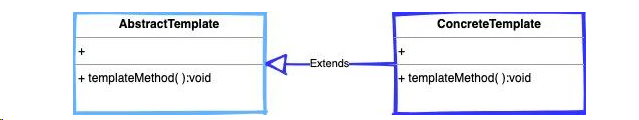
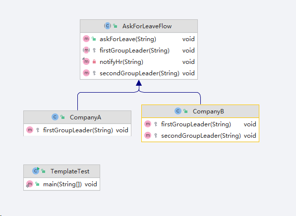

## 模版方法模式

>- 定义：模板方法模式在一个方法中定义一个算法骨架，并将某些步骤推迟到子类中实现。模板方法模式可以让子类在不改变算法整体结构的情况下，重新定义算法中的某些步骤
>
>- 目的：
>
>  1.使用模版方法模式的目的是避免编写重复代码，以便开发人员可以专注于核心业务逻辑的实现
>
>  2.解决接口与接口实现类之间继承矛盾问题

>- AbstractTemplate（抽象模版）：定义一系列抽象方法，或者实现的方法，又或者是钩子方法。即：定义流程
>- ConcreteTemplate（具体模版）：实现父类抽象方法，基于本身不同的模版业务逻辑，实现不同的业务逻辑代码。即：抽象方法实现相同，内部逻辑不同

#### 举例

#### OA办公流程

A公司请假需要直属领导审批以及通知HR有人请假了就可以了，B公司需要直属领导，部门负责人审批最后通知HR，方能完成整个请假流程

### 扩展

#### SpringMVC.Servlet

#### Java IO.InputStream.read

