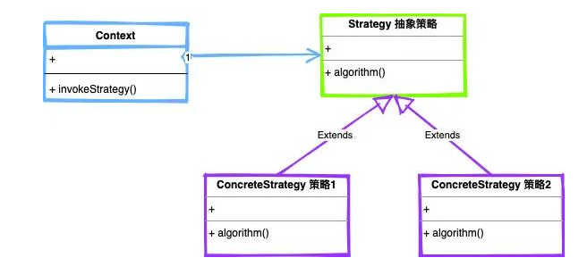
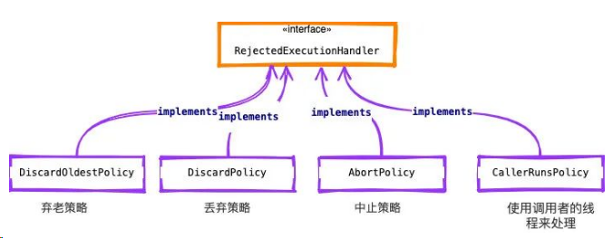

## 策略模式

>定义一系列算法，封装每个算法，并使他们可以互换，不同的策略可以让算法独立于使用它们的客户而变化

​	

>- Strategy（抽象策略）：抽象策略类，并且定义策略执行入口
>- ConcreteStrategy（具体策略）：实现抽象策略，实现algorithm()方法
>- Context（环境）：运行特定的策略类。

### 扩展

#### jdk.ThreadPoolExecutor

>线程池的异常策略
>
>

