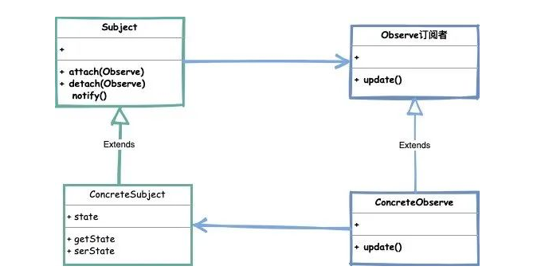
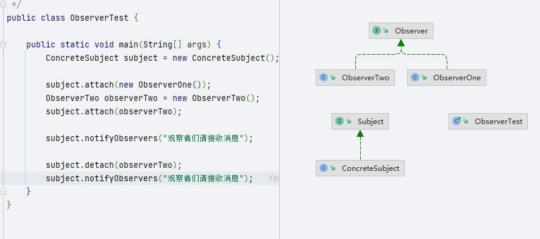
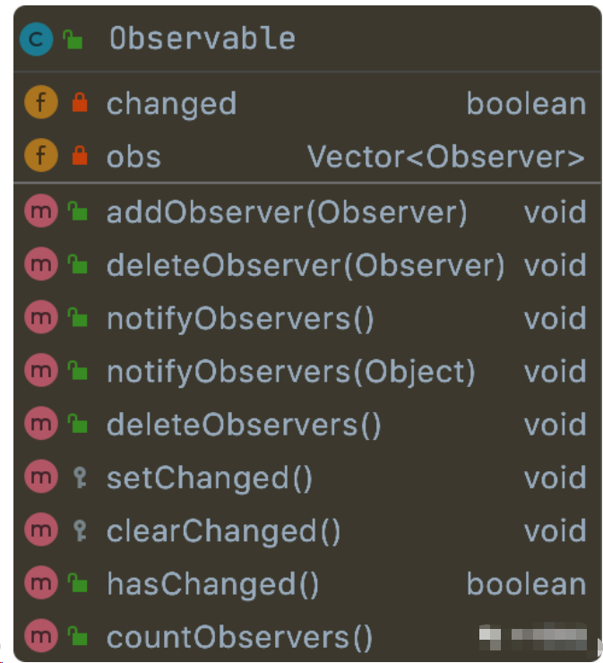

## 观察者模式

>当一个对象的状态发生改变时，已经登记的其他对象能够观察到这一改变从而作出自己相对应的改变。通过这种方式来达到减少依赖关系，解耦合的作用。



>- Subject（主题）: 主要由类实现的可观察的接口，通知观察者使用attach方法，以及取消观察的detach方法。
>- ConcreteSubject（具体主题）: 是一个实现主题接口的类，处理观察者的变化
>- Observe（观察者）: 观察者是一个由对象水岸的接口，根据主题中的更改而进行更新。



### 扩展

#### java.util.Observable

>用Vector 作为订阅关系的容器，同时在他的定义方法中都添加synchronized关键字修饰类，以达到线程安全的目的

>**观察者目标类**
>
>java.util.Observable
>
>
>
>里面两个最重要的变量：
>
>- **changed**：观察目标状态是否变更，默认为：false；
>- **obs**：观察者列表（observers），一个线程安全的列表集合：Vector，默认为空集合；
>
>**观察者接口**
>
>`java.util.Observer`
>
>```java
>public interface Observer {
>    /**
>     * update 方法，用来通知观察者自己更新
>     *
>     * This method is called whenever the observed object is changed. An
>     * application calls an <tt>Observable</tt> object's
>     * <code>notifyObservers</code> method to have all the object's
>     * observers notified of the change.
>     *
>     * @param   o     the observable object.
>     * @param   arg   an argument passed to the <code>notifyObservers</code>
>     *                 method.
>     */
>    void update(Observable o, Object arg);
>}
>```

#### Spring.ApplicationListener

>Spring/ Spring Boot 框架中的事件监听机制，可以实现观察者模式
>
>**ApplicationEvent**
>
>```java
>public abstract class ApplicationEvent extends EventObject {
>
>   /** use serialVersionUID from Spring 1.2 for interoperability. */
>   private static final long serialVersionUID = 7099057708183571937L;
>
>   /** System time when the event happened. */
>   private final long timestamp;
>
>
>   /**
>    * Create a new {@code ApplicationEvent}.
>    * @param source the object on which the event initially occurred or with
>    * which the event is associated (never {@code null})
>    */
>   public ApplicationEvent(Object source) {
>      super(source);
>      this.timestamp = System.currentTimeMillis();
>   }
>
>
>   /**
>    * Return the system time in milliseconds when the event occurred.
>    */
>   public final long getTimestamp() {
>      return this.timestamp;
>   }
>
>}
>```
>
>ApplicationEvent 继承自 Java 中的 EventObject 事件对象类，Spring 框架中的所有事件都继承自 ApplicationEvent 类，它是所有事件的父类。
>
>ApplicationEvent 主要的核心是类构造器，它可以初始化一个 source 事件关联对象，以便在事件监听器中获取并通知更新。
>
>**ApplicationListener**
>
>ApplicationListener（应用程序事件监听器）它是一个接口，相当于观察者模式中的观察者。
>
>```java
>public interface ApplicationListener<E extends ApplicationEvent> extends EventListener {
>
>   /**
>    * Handle an application event.
>    * @param event the event to respond to
>    */
>   void onApplicationEvent(E event);
>
>}
>```
>
>ApplicationListener 继承自 Java 中的 EventListener 事件监听接口，ApplicationListener 类中只有一个 onApplicationEvent 方法，当指定监听的事件被发布后就会被触发执行，可以通过 event 获取事件中的关联对象。
>
>**ApplicationEventPublisher**
>
>应用程序事件发布接口，封装了事件发布功能的基础接口。
>
>```java
>public interface ApplicationEventPublisher {
>
>   /**
>    * Notify all <strong>matching</strong> listeners registered with this
>    * application of an application event. Events may be framework events
>    * (such as ContextRefreshedEvent) or application-specific events.
>    * <p>Such an event publication step is effectively a hand-off to the
>    * multicaster and does not imply synchronous/asynchronous execution
>    * or even immediate execution at all. Event listeners are encouraged
>    * to be as efficient as possible, individually using asynchronous
>    * execution for longer-running and potentially blocking operations.
>    * @param event the event to publish
>    * @see #publishEvent(Object)
>    * @see org.springframework.context.event.ContextRefreshedEvent
>    * @see org.springframework.context.event.ContextClosedEvent
>    */
>   default void publishEvent(ApplicationEvent event) {
>      publishEvent((Object) event);
>   }
>
>   /**
>    * Notify all <strong>matching</strong> listeners registered with this
>    * application of an event.
>    * <p>If the specified {@code event} is not an {@link ApplicationEvent},
>    * it is wrapped in a {@link PayloadApplicationEvent}.
>    * <p>Such an event publication step is effectively a hand-off to the
>    * multicaster and does not imply synchronous/asynchronous execution
>    * or even immediate execution at all. Event listeners are encouraged
>    * to be as efficient as possible, individually using asynchronous
>    * execution for longer-running and potentially blocking operations.
>    * @param event the event to publish
>    * @since 4.2
>    * @see #publishEvent(ApplicationEvent)
>    * @see PayloadApplicationEvent
>    */
>   void publishEvent(Object event);
>
>}
>```
>
>**ApplicationContext**
>
>ApplicationContext 接口继承了 ApplicationEventPublisher 接口，所以常用的 ApplicationContext 就可以用来发布事件。

**Spring 事件监听发布角色**串起来就是，通过 ApplicationEventPublisher 或者 ApplicationContext 容器发布  ApplicationEvent 事件并关联事件对象，然后 ApplicationListener 监听该事件，当事件发布后，监听器就会收执行并获取到事件及关联对象。

#### Guava.EventBus

>- EventBus  // 同步阻塞模式
>- AsyncEventBus // // 异步非阻塞模式
>
>EventBus方法：
>
>- register 方法作为添加观察者
>- unregister方法删除观察者
>- post 方法发送通知消息等