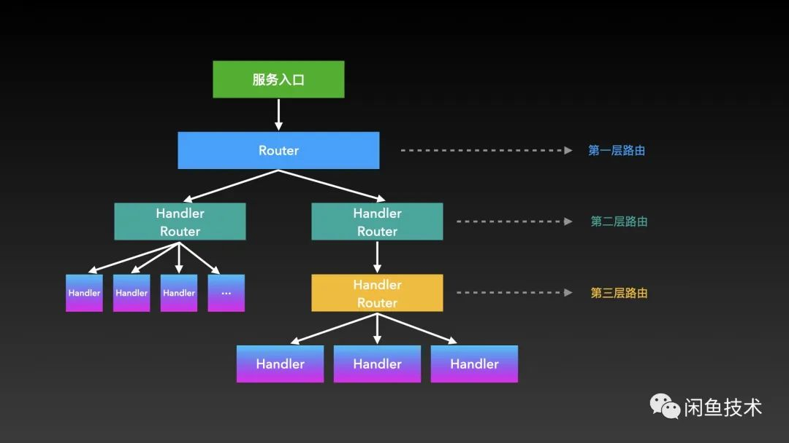
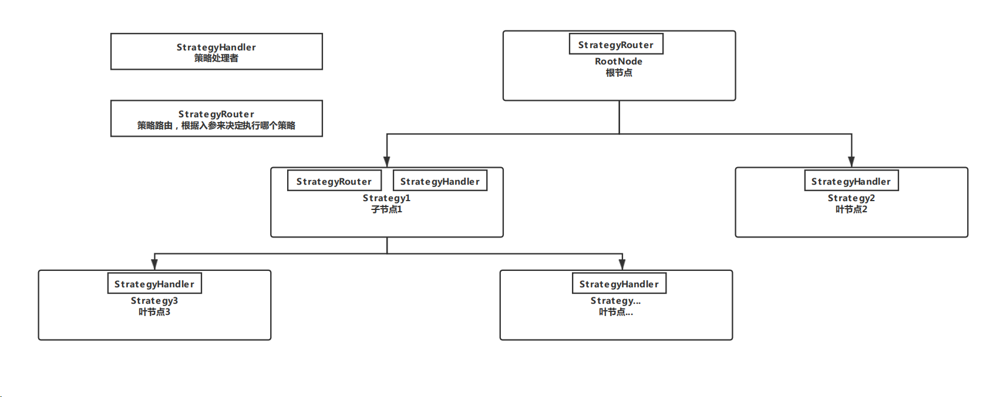

## 责任树模式

>将责任链与策略模式与模板方法模式融合，即成为了一种广义的责任链模式
>
>这种模式不仅可以完成任务的逐级委托，也可以在任一级选择不同的下游策略进行处理。

### 抽象框架

这个框架由一个 Router 和 Handler 组成：

- **Router 是一个抽象类**，负责定义如何路由到下游的多个子节点；
- **Handler 是接口**，负责实现每个节点的业务逻辑。

要点：

* 除了根节点（入口）外，每个节点都实现了 Handler 接口。根节点只继承 Router 抽象类；

* 所有叶子节点只实现 Handler 接口而无需继承 Router 抽象类（无需再向下委托）；

* 除了根节点和叶子节点外的其他节点，都是上一层的 Handler，同时是下一层的 Router；
  

### 扩展

