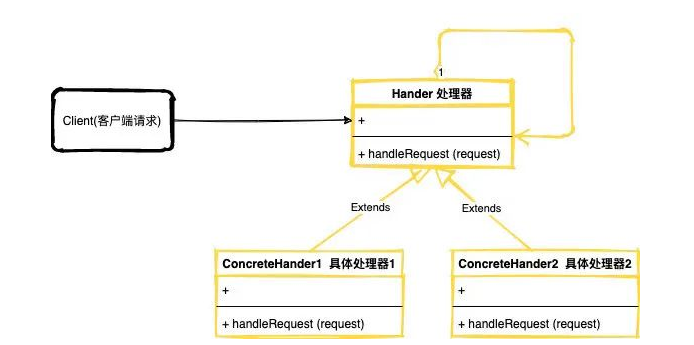
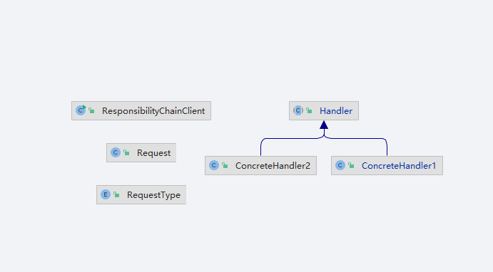

## 责任链模式

>将请求的发送和接收解耦，让多个接收对象都有机会处理这个请求。将这些接收对象串成一条链，并沿着这条链传递这个请求，直到链上的某个接收对象能够处理它为止。

>- Client(客户端)：实例化一个处理器的链，在第一个链对象中调用handleRequest 方法。
>- Handle(处理器)：抽象类，提供给实际处理器继承然后实现handleRequst方法，处理请求
>- ConcreteHandler(具体处理器)：继承了handler的类，同时实现handleRequst方法，负责处理业务逻辑类，不同业务模块有不同的ConcreteHandler。

### 扩展

#### SpringMVC. ServletFilter

#### Spring.SpringInterceptor