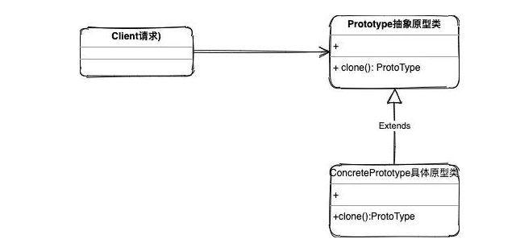

## 原型模式

>原型模式是一种克隆对象的方法。
>
>比如我们常用的的BeanUtils.copyProperties就是一种对象的**浅copy**
>
>实例化对象操作并不是特别耗费性能，所以在针对一些特殊场景我们还是需要克隆那些已经实例化的对象的：
>
>- 依赖外部资源或硬件密集型操作，比如数据库查询，或者一些存在IO操作的场景
>- 获取相同对象在相同状态的拷贝从而不需要重复创建获取状态的操作的情况

`类图`

>- 第一个是抽象原型(prototype)声明clone方法，可以是接口可以是基类，在简单的场景下我们都可以不用基类直接具体类就可以了。
>- 第二个就是具体原型类(concreteprototype)实现或者扩展clone方法，当我们在具体的原型类中的对象方法时，就会返回一个基类的抽象原型对象

`实现`

