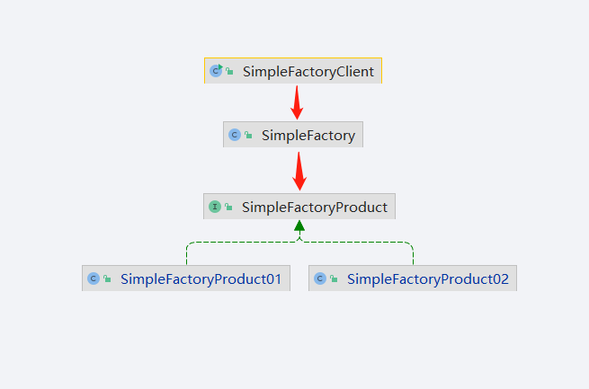

## 工厂模式

`定义`

>定义一个用于创建对象的接口，让子类决定实例化哪一个类。工厂方法使一个类的实例化延迟到其子类。

### 简单工厂模式

#### 静态工厂模式

>简单工厂牧师，如果要创建商品1 以及商品2，我们要创建商品的时候只要调用简单工厂里面的创建商品方法
>
>根据类型创建出不同的商品然后实列化返回就可以了。

### 工厂方法模式

>工厂方法模式是对静态工厂模式的上的一种改进，我们的工厂类直接被抽象化，需要具体特定化的逻辑代码转移到实现抽象方法的子类中，这样我们就不要再去修改工厂类

### 抽象工厂模式