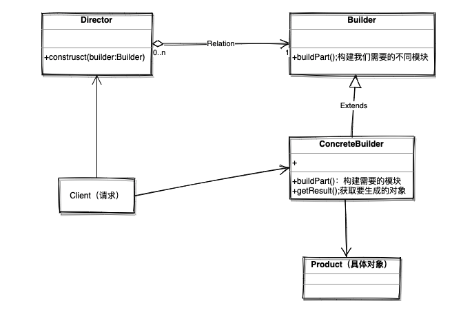

## 建造者模式

>当我们需要实列化一个复杂的类，以得到不同结构类型和不同的内部状态的对象时，我们可以用不同的类对它们的实列化操作逻辑分别进行封装，这些类我们就称之为建造者。当我们需要来之同一个类，但是要就有不同结构对象时，就可以通过构造另一个建造者来进行实列化。

建造者主要分为4种角色：

>- Product(产品类) :我们具体需要生成的类对象
>- Builder(抽象建造者类)：为我们需要生成的类对象，构建不同的模块属性，即：公开构建产品类的属性，隐藏产品类的其他功能
>- ConcreteBuilder(具体建造者类)：实现我们要生成的类对象
>- Director(导演类)：确定构建我们的类对象具体有哪些模块属性，在实际应用中可以不需要这个角色，直接通过client处理

