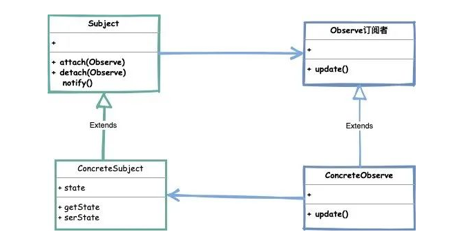
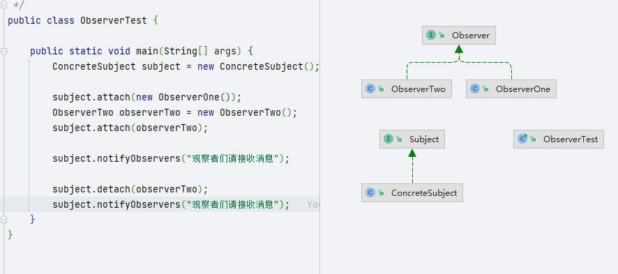

## 观察者模式

>当一个对象的状态发生改变时，已经登记的其他对象能够观察到这一改变从而作出自己相对应的改变。通过这种方式来达到减少依赖关系，解耦合的作用。

>- Subject（主题）: 主要由类实现的可观察的接口，通知观察者使用attach方法，以及取消观察的detach方法。
>- ConcreteSubject（具体主题）: 是一个实现主题接口的类，处理观察者的变化
>- Observe（观察者）: 观察者是一个由对象水岸的接口，根据主题中的更改而进行更新。

### 扩展

#### java.util.Observable

>用Vector 作为订阅关系的容器，同时在他的定义方法中都添加synchronized关键字修饰类，以达到线程安全的目的

#### Spring.ApplicationListener

#### Guava.EventBus

>- EventBus  // 同步阻塞模式
>- AsyncEventBus // // 异步非阻塞模式
>
>EventBus方法：
>
>- register 方法作为添加观察者
>- unregister方法删除观察者
>- post 方法发送通知消息等